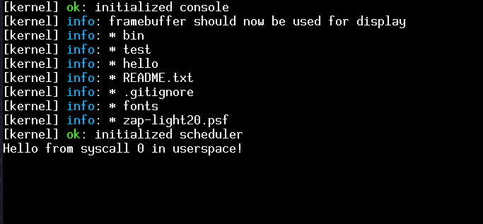

# RadishOS
A x86_64 operating system made from scratch that I am making for learning purposes and for fun.

## Features
- Framebuffer output
- Serial output
- VFS
- USTAR
- TMPFS
- Heap allocator
- 4-level paging

## Roadmap (to the next release)
* [x] Better tmpfs
* [x] VFS
* [x] USTAR
* [x] Framebuffer driver
* [x] initrd
* [x] Framebuffer console
* [x] Cleanup