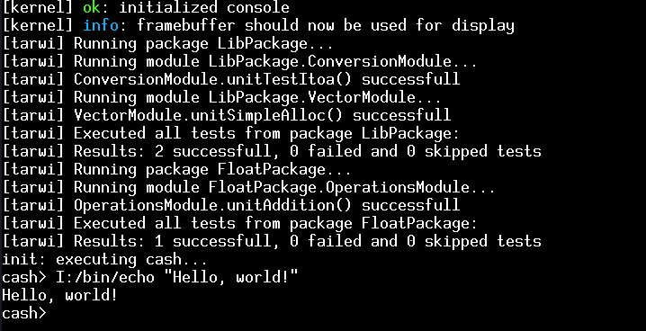

# RadishOS
*Note: this file is up to date with the last release*
A x86_64 operating system made from scratch that I am making for learning purposes and for fun.



## Features
- 7 syscalls
- Userspace
- ELF64 loader
- PIT driver
- 8259 PIC driver
- Preemptive multitasking
- Framebuffer output
- Serial output
- VFS
- USTAR
- TMPFS
- Heap allocator
- 4-level paging

## Components and related projects
* [Lichee](bootloader/): the bootloader (not mature enough, use Limine lol)
* [Kiwi](kernel/): the kernel
* [Tomato](https://github.com/wither16x/tomato-libc): a C99 library
* [Tarwi](https://github.com/wither16x/tarwi): a unit test library in C++

## Building
Before you start, know that you can download an **ISO image** from the latest release. Code from releases is generally more stable and tested than the code from the latest commit. Building the operating system from scratch builds it from the latest commit.

### Downloading source code
* If you are building a **release** from scratch, the code can be downloaded form GitHub as a `.zip` or `.tar.gz` archive
* If you are building the latest committed code from scratch, then you need to clone the repository:
```sh
git clone https://github.com/wither16x/radish_os
```

### Obtaining dependencies
RadishOS depends on other libraries/projects. You can downloaded them all at once by running `scripts/get-deps.sh`.
```sh
./scripts/get-deps.sh
```
This will download
* [Limine protocol](https://github.com/Limine-Bootloader/limine-protocol)
* [Limine bootloader](https://github.com/Limine-Bootloader/Limine)
* [Tomato libc](https://github.com/wither16x/tomato-libc)
* [Tarwi](https://github.com/wither16x/tarwi)

### Build the toolchain
RadishOS needs a specific toolchain to be compiled properly. This toolchain can be automatically generated by running `scripts/toolchain.sh` like this:
```sh
./scripts/toolchain.sh <sysroot>
```
A file named `prefixes.mk` should be generated.

Note that it is better to also build the libc first. To do so, follow the instructions given [here](https://github.com/wither16x/tomato-libc/blob/master/README.md).

### Build the kernel
Make sure [you built the toolchain](#build-the-toolchain)!
First, run `scripts/symbols.sh`. Next, run
```sh
make build-kernel
```
An executable should be generated at `kernel/bin/kernel.elf`.
Verify it using this command:
```sh
file kernel/bin/kernel.elf
```
It should output something like
```
kernel/bin/kernel.elf: ELF 64-bit LSB executable, x86-64, version 1 (SYSV), statically linked, not stripped
```

### Build the user programs
You can compile some user programs and even write custom ones! To build the available programs, run
```sh
make build-userspace
```
This should generate two executables:
* `userspace/hello/bin/hello`
* `userspace/shell/bin/shell`

### Build the initrd
The kernel needs several files to work properly. These files are stored inside a tar archive.
To build this tar archive, make sure that [the user prorgrams are compiled] and run
```sh
make build-initrd
```

### Build an ISO image
The last step is to build an **ISO image**. This can be done by simply running
```sh
make build-iso
```
This will generate an ISO image at `images/radish_os.iso`.

## Running
You can try RadishOS in an emulator like qemu, or run it on real hardware.
To emulate it in qemu, run:
```sh
qemu-system-x86_64 -cdrom images/radish_os.img -m 2G # or another value
```
**WARNING**: RadishOS has not been tested on real hardware yet!

## Code quality
As you can I see I am not one to write the best algorithms...
I try to keep my code as clean as possible.

## Use of AI in this project
Because it is a learning project, I try to not use AI at all.
However, if it happens, be sure that I will rewrite the AI-generated stuff quickly.